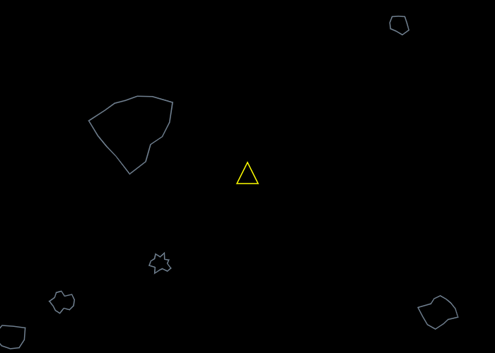

<h1 align="center">
    Asteroid JS
</h1>

  

  
  
  

  

  

  <a href="#rocket-techs">Techs</a>&nbsp;&nbsp;&nbsp;|&nbsp;&nbsp;&nbsp;
  <a href="#-project">Project</a>&nbsp;&nbsp;&nbsp;|&nbsp;&nbsp;&nbsp;
  <a href="#-how-to-play">How to Play</a>&nbsp;&nbsp;&nbsp;|&nbsp;&nbsp;&nbsp;
  <a href="#-game">Game</a>&nbsp;&nbsp;&nbsp;|&nbsp;&nbsp;&nbsp;
  <a href="#-how-to-contribute">How to Contribute</a>&nbsp;&nbsp;&nbsp;|&nbsp;&nbsp;&nbsp;
  <a href="#memo-license">License</a>&nbsp;&nbsp;&nbsp;|&nbsp;&nbsp;&nbsp;
  <a href="#-collaborator">Collaborator</a>
  <a href="#-author">Author</a>

## :rocket: Techs

This project was developed with the following technologies:

- [Javascript](https://www.w3schools.com/js/)
- [HTML](https://www.w3schools.com/html/)
- [CSS](https://https://www.w3schools.com/css/)

## 💻 Project

AsteroidJS is a game made with javascript and html5 that consists of a spaceship to destroy the asteroids that appear in space.

## 🤔 How to Play

use the arrow keys to change the direction of the ship and press the space key on the keyboard to fire shots at the asteroids.

#### - Move Left
- To move to the left side press the left arrow key on your keyboard.

#### - Move Right
- To move to the right side press the right arrow key on your keyboard.

#### - To Go Forward
- To move forward press the top key on your keyboard.

#### - To Fire
- To fire press the space key on your keyboard.

## Game

[link to play](https://asteroidjs.netlify.com/)

## 🤔 How to Contribute

- Fork this repository;
- Create a branch with your feature: `git checkout -b my-feature`;
- Commit your changes: `git commit -m 'feat: my new feature'`;
- Push to your branch: `git push origin my-feature`.

After the merge of your pull request is done, you can delete your branch.

## :memo: License

This project is under the MIT license. See the archive [LICENSE](LICENSE.md) for more details.

## Collaborator

[Acidiney Dias](https://github.com/acidiney)

## Author

[Carlos Garcia](https://github.com/CarlCr)
